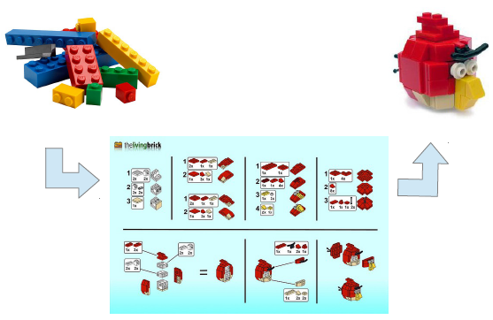

# Introducción a la programación con JavaScript

## Objetivos
El objetivo del curso es dar los primeros pasos en el desarrollo de aplicaciones web. Para ello nos proponemos:

+ Conocer las reglas sintácticas y semánticas que definen la estructura y significado de los elementos y expresiones del lenguaje de programación JavaScript 
+ Aprender cómo se ejecuta JavaScript en un navegador  
+ Ampliar su funcionalidad y facilitar el desarrollo mediante el uso de librerías, especialmente de _web mapping_  

No son objetivos de este curso:

+ Profundizar en las técnicas avanzadas de JavaScript en: orientación a objetos, programación funcional, módulos...  
+ Profundizar en patrones MVC (modelo-vista-controlador) y similares del lado del cliente  
+ JavaScript en el servidor y aplicaciones de escritorio  
+ Aplicaciones para dispositivos móviles híbridas

#### Requisitos:

+ Conocimientos de HTML, CSS

Antes de empezar es importante dejar una cosa clara. No es lo mismo aprender un lenguaje de programación que aprender a programar.

Programar es decirle a un ordenador lo que _queremos_ que haga mediante un programa escrito con un lenguaje que éste entiende (en nuestro caso, Javascript). Al ejecutar el programa el ordenador hará lo que le hemos _dicho_ que haga (no lo que nosotros _queremos_).

  > Primero resuelve el problema, luego escribe el código  
  > - John Johnson

Por una parte debemos memorizar la sintaxis y la semántica del lenguaje de programación, y por otra aprender a resolver problemas algorítmicamente. Este aprendizaje sólo se obtiene con la práctica, la creatividad y la buena disposición.

  > El desarrollo de software ha sido, es, y probablemente será, fundamentalmente difícil  
  > - Grady Booch

  > ... Y el que diga lo contrario miente  
  > - Xisco G

## Contenido del curso

### [Introducción a los clientes web geoespaciales](./modulo0/) 
Evolución de los GIS  
Servidores geoespaciales  
Clientes web de mapas  
Rendimiento  
Ejemplo aplicación web sencilla  
Presente y futuro del sector geoespacial  

### [Qué es Javascript](./modulo1/) 
Historia  
Ventajas de javascript  
Arquitectura de una aplicación web moderna  
Herramientas

### [Introducción al lenguaje de programación](./modulo2/)
Tipos de datos, variables, expresiones, operadores, conversión de tipos  
Control de flujo: condicionales y bucles

### [Objetos predefinidos, arrays y funciones](./modulo3/)
String, Date, Math  
El objeto Array  
Funciones: definición, parámetros y alcance

### [Programación orientada a objetos](./modulo4/)
Prototipos  
Creación de objetos  
Herencia  

### [Javascript en el navegador](./molulo5/)
Document object model (DOM)  
Browser object model (BOM)  
Eventos  
JSON y Ajax  

### [Más fácil con librerías](./modulo6/)
Independencia del navegador y simplificación de acceso a objetos: JQuery  
Mapas interactivos: OpenLayers 3

## Ampliar información
+ **JavaScript: The Definitive Guide, Sixth Edition**  
  David Flanagan. 2011 O’Reilly Media  
+ **JavaScript for Absolute Beginners**  
  Terry McNavage. 2010 Apress
+ **Jump Start JavaScript**  
  Ara Pehlivanian, Don Nguyen. 2013 SitePoint
+ **JavaScript for Web Developers, Third Edition**  
  Nicholas C. Zakas. 2012 John Wiley & Sons  
+ **Eloquent JavaScript. A Modern Introduction to Programming, Second edition**  
  Marijn Haverbeke. 2014 <a href="http://eloquentjavascript.net/" target="_blank">Leer online</a>  
+ **Learning JavaScript. A Hands-On Guide to the Fundamentals of Modern JavaScript**  
  Tim Wright. 2012 Addison-Wesley  
+ **The Modern Web. Multi-Device Web Development with HTML5, CSS3, and JavaScript**  
  Peter Gasston. 2013 No Starch Press  
+ **Head First JavaScript**  
  Michael Morrison. 2008 O’Reilly Media
+ **JavaScript & jQuery: The Missing Manual, Second Edition**  
  David Sawyer McFarland. 2012 O’Reilly Media  
+ **Head First jQuery**  
  Ryan Benedetti y Ronan Cranley. 2011 O’Reilly Media  
+ **OpenLayers Cookbook** (2.10)  
  Antonio Santiago. 2012 Packt Publishing  
+ **The book of OpenLayers 3. Theory & Practice**  
  Antonio Santiago. 2014 Leanpub  
+ **OpenLayers 3: Beginner's Guide**  
  Thomas Gratier, Paul Spencer, Erik Hazzard. 2015 Packt Publishing  
+ **97 Things Every Programmer Should Know**  
  Kevlin Henney. 2010 O’Reilly Media   
+ **Code Complete, Second Edition**  
  Steve McConnell. 2004 Microsoft Press   
+ <a href="http://www.jstherightway.org" target="_blank">**JavaScript: The Right Way**</a>  
  William Oliveira
