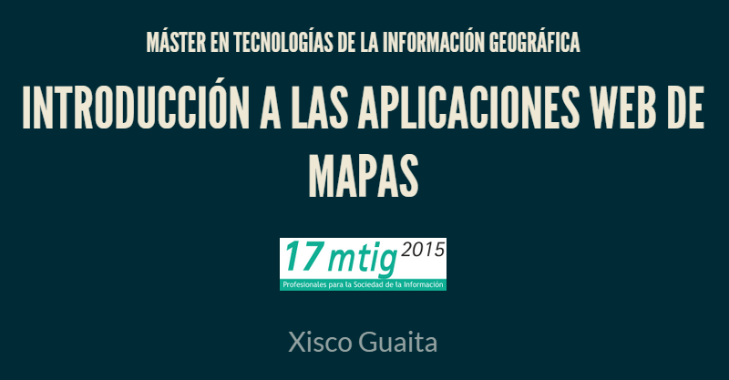

# Introducción a los clientes web geoespaciales
Objetivos: 
 
  + Diferenciar los componentes de una aplicación web de mapas  
  + Conocer los diferentes factores que influyen en el rendimiento de las aplicaciones web geoespaciales  
  + Descubrir que desarrollar una aplicación informática no es una tarea trivial  

